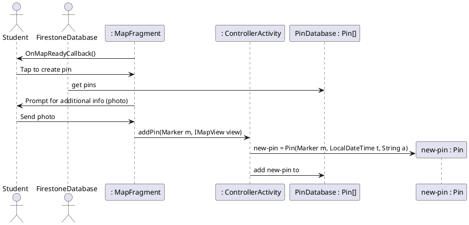

# Add Pin

### Primary Actors and Goals

__Student__: Wants to add a pin to the map, showing off the location 
and a photo of an animal they spotted on campus.

__Firestore Database__: Stores collections of data. 

### Preconditions
* The student has opened the app
* The student is looking at the map screen
* The app has connected to Google Maps
* The student has long tapped to create a pin

### Post-conditions
* The pin location and photo have been uploaded 
* The app has returned to the map screen

### Workflow

```plantuml
'define swimlanes
|#technology|Student|
|#implementation|System|

|System|
start
if (Is location within Vassar?) then (No(Cancel))
    stop
else (Yes)
endif
|Student|
:Enter Name;
:Enter Id (optional);
|System|
:Save location;
:Execute __Upload Photo__;
:Upload data to database;
:Save timestamp;
:Return to map screen;
stop


```

### Sequence Diagram

