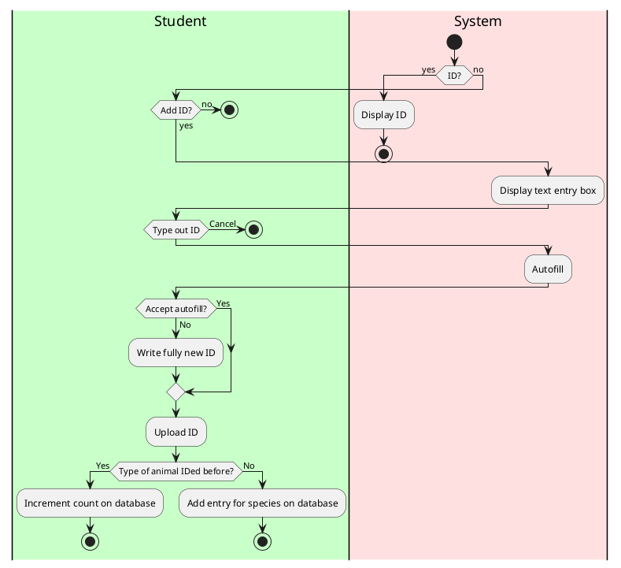
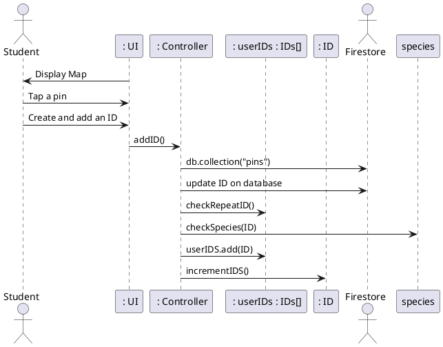

# Add ID

### Primary Actors and Goals

__Student__: Wants to identify an animal see in someone else's photo.
__Firestore Database__: Stores collections of data.  

### Preconditions
* The student has opened the app
* The student is looking at the map screen
* The app has connected to Google Maps
* The student has clicked a pin and viewed the photo attached
* They have selected the add ID button

### Post-conditions
* The ID has been uploaded to the server and linked to the pin
* The app has returned to the map screen

### Workflow

### Sequence Diagram

