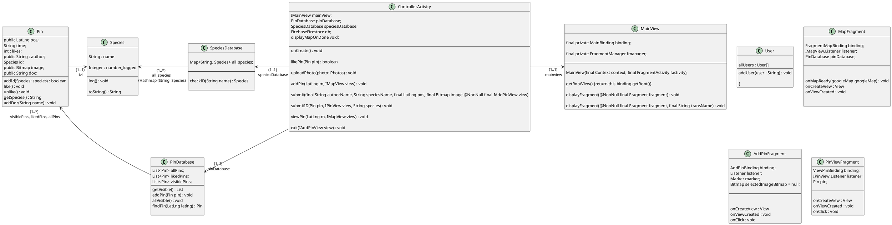

```plantuml
@startuml

class Pin{
public LatLng pos;
String time; 
int : likes;
public String : author;
Species id;
public Bitmap image;
public String doc;
--
addId(Species: species) : boolean
like() : void
unlike() : void
getSpecies() : String
addDoc(String name) : void
}


class ControllerActivity{
IMainView mainView;
PinDatabase pinDatabase;
SpeciesDatabase speciesDatabase;
FirebaseFirestore db;
displayMapOnDone void;

--
onCreate() : void

likePin(Pin pin) : boolean

uploadPhoto(photo: Photos) : void 

addPin(LatLng m, IMapView view) : void

submit(final String authorName, String speciesName, final LatLng pos, final Bitmap image,@NonNull final IAddPinView view)

submitID(Pin pin, IPinView view, String species) : void

viewPin(LatLng m, IMapView view) : void

exit(IAddPinView view) : void
}


class MainView{

final private MainBinding binding;

final private FragmentManager fmanager;

--

MainView(final Context context, final FragmentActivity factivity);

getRootView() {return this.binding.getRoot()}

displayFragment(@NonNull final Fragment fragment) : void

displayFragment(@NonNull final Fragment fragment, final String transName) : void
}


class Species{

String : name

Integer : number_logged

--
log() : void

toString() : String
}

class SpeciesDatabase{

Map<String, Species> all_species;

--

checkID(String name) : Species

}

class PinDatabase{
    List<Pin> allPins;
    List<Pin> likedPins;
    List<Pin> visiblePins;
--
    getVisible() : List
    addPin(Pin pin) : void
    allVisible() : void
    findPin(LatLng latlng) : Pin     
    
}


class User{

allUsers : User[]
--
addUser(user : String) : void

{
}

class MapFragment{

FragmentMapBinding binding;
IMapView.Listener listener;
PinDatabase pinDatabase;

--


onMapReady(googleMap googleMap) : void
onCreateView : View
onViewCreated : void


}

class AddPinFragment{

AddPinBinding binding;
Listener listener;
Marker marker;
Bitmap selectedImageBitmap = null;

--


onCreateView : View
onViewCreated : void
onClick : void
}

class PinViewFragment {
ViewPinBinding binding;
IPinView.Listener listener;
Pin pin;

--

onCreateView : View
onViewCreated : void
onClick : void
}


ControllerActivity -> "(1..1)\n mainview" MainView : \t\t\t
SpeciesDatabase -left-> "(1..*) \n all_species \n {Hashmap (String, Species)" Species : \t\t\t\t\t
Pin -> "(1..1)\n id" Species : \t
ControllerActivity -down-> "(1..1)\n pinDatabase" PinDatabase
ControllerActivity -left-> "(1..1)\n speciesDatabase" SpeciesDatabase : \t\t\t
PinDatabase -left-> "(1..*) \n visiblePins, likedPins, allPins" Pin


```