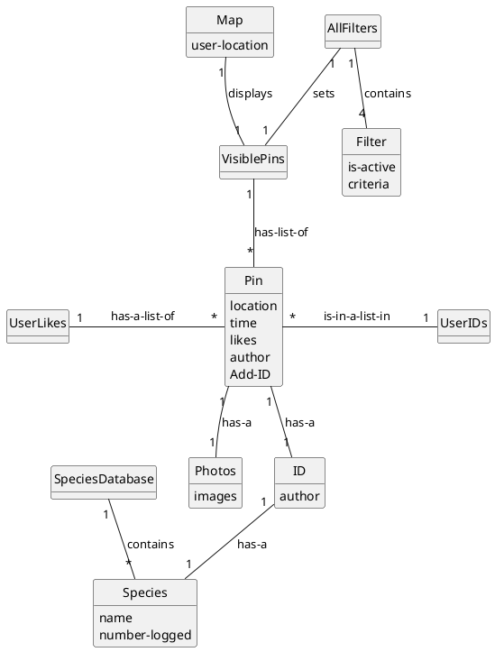

```plantuml
@startuml
hide circle
hide empty methods

'classes
class Pin{
location
time
likes
author
Add-ID
}
class VisiblePins{
}
class Map{
user-location

}
class AllFilters{

}
class Filter{
is-active
criteria
}
class SpeciesDatabase{

}

class UserLikes
{
}

class UserIDs
{
}
class Photos{
images
}
class ID{
author
}
class Species{
name
number-logged
}


Pin "1" -- "1" Photos : has-a
AllFilters "1" -- "4" Filter : contains
SpeciesDatabase "1" -- "*" Species : contains
UserLikes "1" - "*" Pin : \thas-a-list-of\t\t
UserIDs "1" -left- "*" Pin : \tis-in-a-list-in\t\t
Pin "1" -- "1" ID : has-a
Map "1" -- "1" VisiblePins : displays
AllFilters "1" -- "1" VisiblePins : sets
VisiblePins "1" -- "*" Pin : has-list-of
ID "1" -- "1" Species : has-a


```