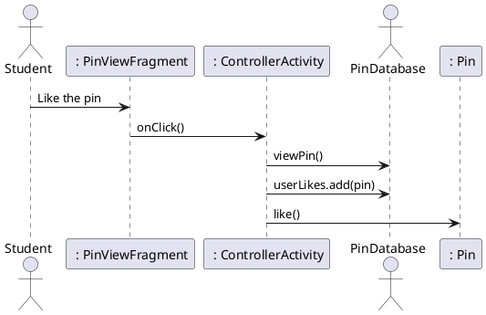

# Like Pin

### Primary Actors and Goals

__Student__: Wants to like a photo and pin someone else has added to the map.


### Preconditions
* The student has opened the app
* The student is looking at the map screen
* The app has connected to Google Maps
* The student has selected a pin

### Post-conditions
* The likes on the server have been incremented
* The app has saved locally that the user liked that photo, so they cannot like it again
* The app has returned to the map screen

### Workflow
```plantuml
'define swimlanes
|#technology|Student|
|#implementation|System|
|Student|
start
:like pin;
|System|
if (liked by user) then (yes)
    |System|
    :save like;
    :increment likes on database;
    stop
else (no)
    |System|
    :erase like;
    :decrease likes on database;    
    stop


```

### Sequence Diagram


