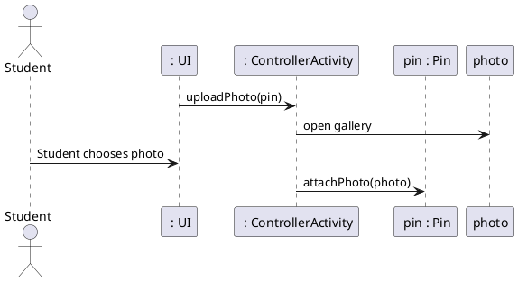

# Upload Photo

### Primary Actors and Goals

__Student__: Wants to upload a photo to the pin they have started creating.

### Preconditions
* The student has opened the app
* The student is looking at the map screen
* The app has connected to Google Maps
* The student has pressed the button to create a pin
* Student is in the middle of creating a pin

### Post-conditions
* The photo has been saved
* The app has returned to __Add Pin__

### Workflow
```plantuml
'define swimlanes
|#technology|Student|
|#implementation|System|

|Student|
while (Uploading photo?) is (Yes)
    :Open Gallery;
 if (Is photo valid?) then (No)
    |Student|
    if (Try again?) then (No(Cancel))
        stop
    else (Yes)
    endif
else (Yes) 
|System|
:Save photo;
if (Add another photo?) then (No)
:Return to __Add Pin__;
stop
else(Yes)
endif
endif
endwhile
stop


```

### Sequence Diagram

