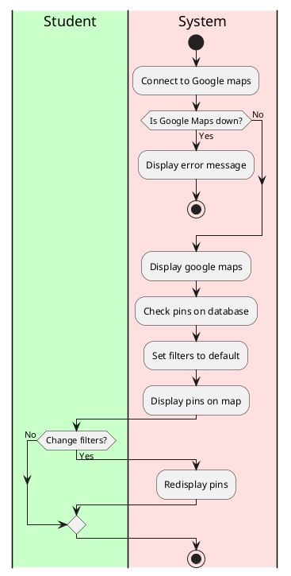
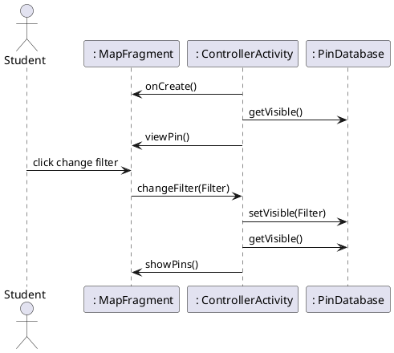

# View Map

### Primary Actors and Goals

__Student__: Wants to view the map
 

### Preconditions
* The student has opened the app

### Post-conditions
* App has connected to google maps

### Workflow

### Sequence Diagram

