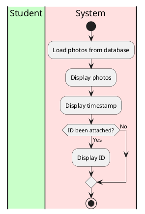
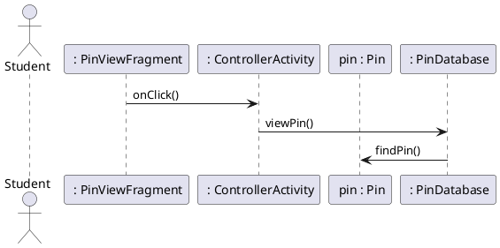

# View Sighting

### Primary Actors and Goals

__Student__: Wants to view a sighting

__Database__: Wants to keep all pins in one place

### Preconditions
* The student has opened the app
* Student is looking at the map
* Student has tapped a pin currently displayed on the map

### Post-conditions
* Student is looking at a pin

### Workflow

### Sequence Diagram
