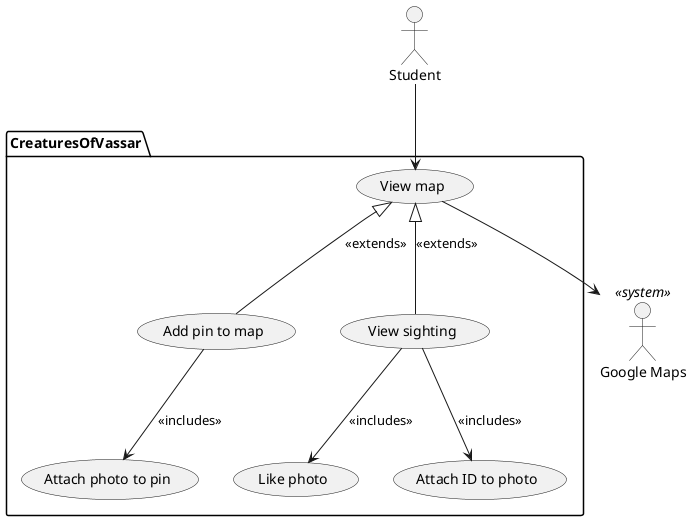

# Creatures of Vassar
Our app is called Creatures of Vassar. The goal of our app is to allow students to share images 
and IDs of the different animals that live on Vassar. Students will use the app to 
share the pictures they've taken of animals and share the animals' location. Students can 
add IDs of animals other people have posted as well. The app will have a map feature with pins of the different animals 
sighted across campus. 

## Student 
Students can share images and locations of animals in the app. The images posted can be liked 
by other students. Students can also ID the animals they post pictures of, and they can also 
ID animals shared by other students. If a nearby animal was sighted recently, students 
will receive a notification from the app. 

## Stakeholders
Campus security can use this app to monitor wildlife around Vassar. 

## Main features 
Users of Creatures of Vassar are able to pin a location on the Vassar campus where an animal was sighted.
Upon sighting the animal, the user can upload a picture and ID it on the app. 
Other users will be notified when an animal
has been sighted. The users can like the photos and ID other users photos, if the user did not ID their own photo. 
Users can filter IDs based on: 
* When the pins were added. 
* The species of animal. 
* If an animal has been IDed.
* If the user has liked a pin.

## Constraints
Creatures of Vassar will be limited to being used on Vassar campus, and won't be able to be 
used outside of it. There also will not be a profile system. Any information uploaded by a user is
anonymous, including photos, ids, and likes. The only information able to be uploaded are
photos and ids, there will be no comments or other forms of user interaction besides liking other
photos. Very little information will be saved locally between sessions. As described in features, pins and photos expire after a set period of time. These
pins, photos, and the ID attached will not be saved anywhere after the expiration
time. Also, multiple IDs will not be able to be uploaded, and IDs will not be able to be changed or challenged if they are incorrect.

